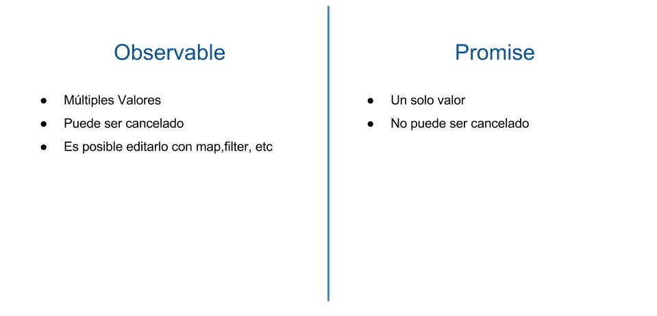

# RXJS Observables

Los observables son parte de la biblioteca de extensiones de [ReactiveX](http://reactivex.io/) tambien conocido como
RxJS y los cuales se utilizan ampliamente en angular 4.

El proposito de ReactiveX es proporcionar un API para la programación asincrona
basada en Observables, que quiere decir eso, pues que los observables nos brindan un
flujo asincrono de datos al cual podemos suscribirnos, de manera que cuando nuevos datos sean
emitidos, podamos recibirlos automaticamente.

Un ejemplo sencillo seria, el pensar en la recepcion de los precios de las acciones en la bolsa
en el momento que ingresas visualizas un precio y luego puede ir modificandose en el lapso del tiempo.
Dado que los precios de las acciones fluctuan constantemente un Observable podria emplearse para
actualizar estos valores.

Los observables funcionan como un matriz, es por eso que es recomendado usar el operador map
con el fin de procesar las respuestas

Cuales con las diferencias entre un Observable y una Promesa


```
import { Observable } from 'rxjs/Observable';
import 'rxjs/add/observable/of';
import 'rxjs/add/operator/map';

Observable.of(1,2,3).map(x => x + '!!!'); // etc
```
